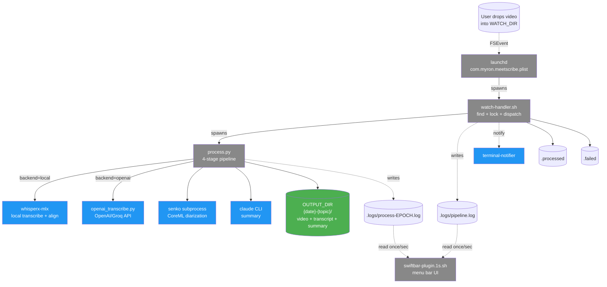

# Архитектура

## Цель и контекст

`meetscribe` - это персональный automation-инструмент: видео-запись OBS превращается в транскрипт и AI-саммари с action items без ручных шагов. Целевая платформа - только macOS Apple Silicon (требования инференса MLX и CoreML). Запускается фоном через launchd: пользователь дропает видео в `WATCH_DIR`, через несколько минут получает готовый результат в `OUTPUT_DIR`.

## Компоненты

Диаграмма ниже показывает физическое разделение системы: launchd подхватывает FSEvent на каталог, спавнит shell-handler, тот - Python pipeline, а pipeline уже ходит к локальным моделям или внешним API. Параллельно SwiftBar читает логи раз в секунду и отрисовывает текущий статус в menu bar.

## Точки расширения

**Backend dispatch**: env-переменная `TRANSCRIBE_BACKEND=local|openai` переключает реализацию первых двух шагов pipeline. Local-вариант гоняет два subprocess с MLX-моделями, openai-вариант заменяет их на один HTTP-запрос. См. [ADR-0003](adr/0003-openai-backend-base-url-for-groq-compat.md) - тот же openai-клиент через `OPENAI_BASE_URL` направляется на Groq без изменения кода.

**Diarization retry**: senko запускается до 3 раз подряд, и если все попытки провалились - pipeline продолжается без speaker labels (транскрипт сохраняется без `[Speaker N]` тегов). См. [ADR-0007](adr/0007-hf-token-required-for-local-diarization.md) о том, почему `HF_TOKEN` сейчас обязателен и план Phase 3 сделать его опциональным с автоматическим fallback.

## Что читать дальше

| Я хочу понять... | Открой |
|---|---|
| Как работает 4-stage pipeline | [pipeline.md](pipeline.md) |
| Как handler детектит и обрабатывает файлы | [watch-handler.md](watch-handler.md) |
| Что происходит при ошибках, как retry устроен | [error-handling.md](error-handling.md) |
| Почему такие технические решения | [adr/README.md](adr/README.md) |
| Куда движется архитектура (Phase 2+) | [roadmap.md](roadmap.md) |
