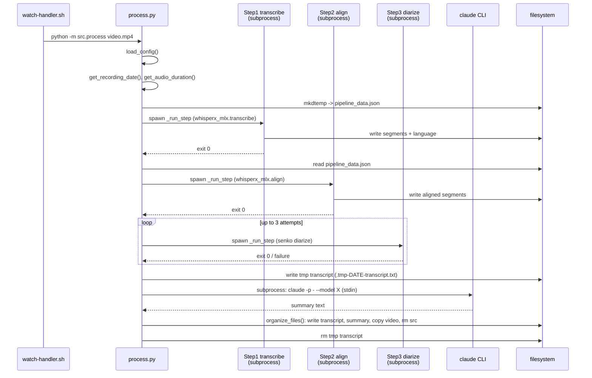
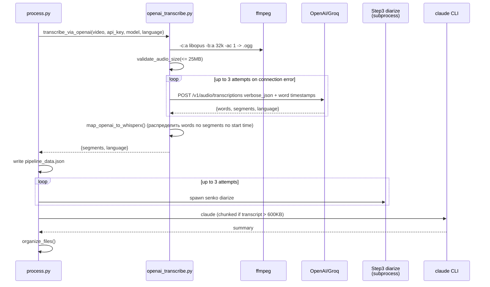

# Pipeline

## Обзор

Вход pipeline - mp4-видео; выход - два файла рядом с копией исходного видео: `transcript.txt` (timestamps + speaker tags) и `summary.md` (Russian, structured action items). Pipeline делится на 4 шага: `[1/4] Transcribe → [2/4] Align → [3/4] Diarize → [4/4] Summary`. При `TRANSCRIBE_BACKEND=openai` шаги 1+2 объединяются в один API-вызов с word-level timestamps, остальные шаги идентичны local-варианту.

## Local backend flow

Sequence-диаграмма ниже показывает локальный backend: handler спавнит `process.py`, тот создаёт `tmp_dir/pipeline_data.json` и последовательно запускает три subprocess-а (transcribe, align, diarize) через `_run_step`. Каждый subprocess читает входные данные из JSON и пишет туда свой результат. После diarize формируется временный transcript, который скармливается в `claude` CLI для саммари, и в конце `organize_files` переносит видео и пишет финальные файлы в `OUTPUT_DIR`.

## OpenAI backend flow (включая будущий Groq через OPENAI_BASE_URL)

Когда `TRANSCRIBE_BACKEND=openai`, шаги 1+2 заменяются одним вызовом `transcribe_via_openai`. Видео сначала перегоняется в моно-Opus 32 kbps через ffmpeg, чтобы влезть в 25 MB API-лимит, затем уходит в `/v1/audio/transcriptions` с `verbose_json` и word timestamps. После этого `map_openai_to_whisperx` распределяет word-таймстемпы по segments так, чтобы дальше pipeline (diarize, claude) работал с тем же форматом, что и local backend.

## Изоляция памяти через subprocess

Каждый шаг с тяжёлой моделью (whisperx transcribe, whisperx align, senko diarize) запускается в отдельном subprocess через `_run_step()`, а данные между шагами летают в JSON-файле `tmp_dir/pipeline_data.json`. Это нужно потому что MLX и senko после работы оставляют резидентные тензоры в Python-процессе, и держать их одновременно в памяти на 16 GB Mac означает swap thrashing. См. [ADR-0001](adr/0001-subprocess-isolation-for-pipeline-stages.md) - subprocess-границы дают ОС однозначный сигнал освободить память между этапами.

## Backend dispatch

Конфиг `cfg["transcribe_backend"]` (значения `local` | `openai`, дефолт `local`) выбирается в начале pipeline и переключает реализацию шагов 1+2: либо два subprocess-а с MLX, либо один HTTP-вызов через `openai_transcribe.py`. См. [ADR-0003](adr/0003-openai-backend-base-url-for-groq-compat.md) о том, как тот же openai-клиент работает с Groq через `OPENAI_BASE_URL`, и [ADR-0006](adr/0006-audio-format-ogg-not-opus-for-openai.md) - почему расширение `.ogg`, а не `.opus`.

## Step markers

Pipeline печатает префиксы вида `[N/4] Step name` в начале каждого шага (`src/process.py:198, 211, 238, 262`, и финальный `[4/4]` на `src/process.py:484`). Эти строки уходят в `.logs/process-EPOCH.log` и SwiftBar plugin парсит их регэксом `\[[1-4]/4\]` чтобы показать текущий шаг в menu bar. См. [ADR-0005](adr/0005-swiftbar-status-via-log-parsing.md). Любое изменение формата маркера ломает SwiftBar - индикация остановится на предыдущем шаге.

## Summary chunking

Когда transcript превышает 600 000 символов, `summarize_transcript` переходит в chunked-режим: (1) сплитит transcript по строкам сегментов так, чтобы каждый chunk не выходил за `MAX_TRANSCRIPT_CHARS`; (2) для каждого chunk делает отдельный `claude` вызов с промптом "Суммаризируй часть N из M"; (3) финальным merge-вызовом склеивает partial summaries по основному `SUMMARY_PROMPT`. Reference: `src/process.py:356-397`.

## Константы

| Константа | Значение | Назначение |
|---|---|---|
| `MAX_TRANSCRIPT_CHARS` | 600_000 | Порог для chunking. ~15-20 минут разговорной речи на сегмент. |
| `MAX_VIDEO_DURATION_SEC` | 4 * 3600 | Hard limit. Длиннее - rejected с подсказкой "split first". |
| `WHISPERX_TIMEOUT_SEC` | 3600 | Per-step subprocess timeout (1 час на шаг). |
| `OPENAI_FILE_LIMIT_BYTES` | 25 * 1024 * 1024 | OpenAI API лимит (~108 мин при 32 kbps mono Opus). |
| `MAX_RETRIES` (API) | 3 | Retry для ConnectionError/APIConnectionError/APITimeoutError. |
| `RETRY_BACKOFF_SEC` | 2 | Базовая пауза, умножается на номер попытки. |
