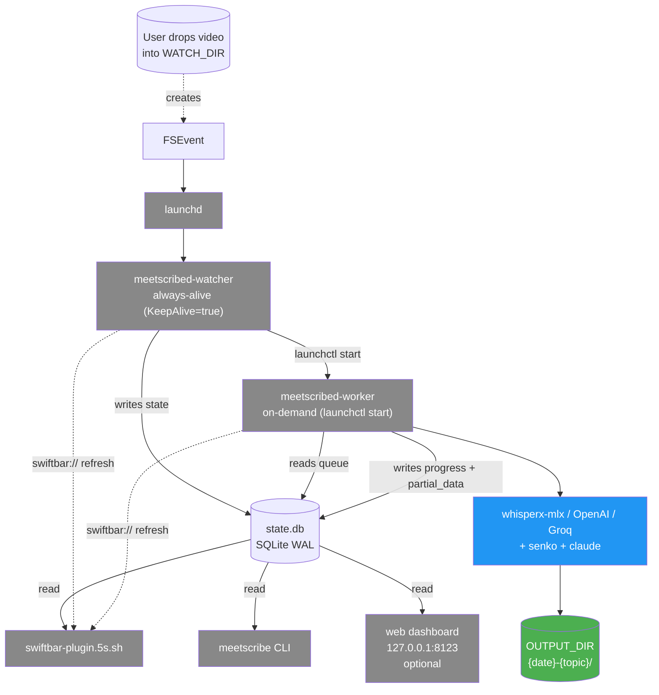

# Roadmap

Этот документ - живая страница "где мы сейчас в миграции к target architecture". Spec в `docs/superpowers/specs/2026-04-29-target-architecture-design.md` (локальный, gitignore) - immutable design record. Этот roadmap обновляется в каждой Phase 3X по мере shipping.

## Target architecture

Цель миграции описана в [ADR-0008](adr/0008-sqlite-as-state-authority.md), [ADR-0009](adr/0009-two-daemon-architecture.md), [ADR-0010](adr/0010-launchctl-on-demand-worker.md), [ADR-0011](adr/0011-swiftbar-url-scheme-refresh.md), [ADR-0013](adr/0013-path-only-video-identity.md), [ADR-0014](adr/0014-blob-partial-data-for-crash-recovery.md).

Высокоуровневая схема: launchd запускает `meetscribed-watcher` (always-alive). Watcher слушает FSEvent на `WATCH_DIR`, делает stability check, пишет в `state.db` (SQLite). При появлении queued видео - `launchctl start` запускает `meetscribed-worker`. Worker дренирует queue, пишет progress + partial_data в state.db, exits на пустой queue. SwiftBar plugin, CLI и (опционально) web dashboard читают state.db. Watcher и worker push refresh в SwiftBar через `swiftbar://refreshplugin`.

## Phased migration

Каждая phase ниже - свой brainstorm → spec → plan → PR cycle. Выбор phased подхода зафиксирован в [ADR-0012](adr/0012-phased-migration-strategy.md).

### Phase 1: documentation snapshot (done)

PR: [#1](https://github.com/mshykhov/meetscribe/pull/1) (squash-merged 2026-04-29).

4 architecture docs + 7 ADRs (0001-0007) описывающих "as-was" state.

### Phase 2: target architecture roadmap (этот документ - in progress)

7 ADRs (0008-0014) + roadmap.md + ADR-0005 superseded.

### Phase 3a: state.db parallel write (done)

Создать SQLite schema (videos, attempts, events, rate_limits, schema_version). Existing `watch-handler.sh` + `process.py` пишут в state.db parallel к `.processed`/`.failed`. Reads всё ещё через файлы. CLI `meetscribe ls` (read-only на state.db) - smoke test что данные пишутся.

**Success criteria:**
- `state.db` создаётся при первом FSEvent.
- Каждое video которое flow-ит через handler даёт `INSERT INTO videos`.
- Каждая попытка обработки даёт `INSERT INTO attempts`.
- `meetscribe ls` показывает то же что `cat .processed` (для done) и `cat .failed | sort -u` (для failed).
- `.processed`/`.failed` всё ещё authoritative для handler-логики.

### Phase 3b: meetscribed-watcher daemon (done)

Python daemon заменяет `watch-handler.sh`. launchd plist `com.myron.meetscribe.watcher` (KeepAlive=true). FSEvent через библиотеку (вероятно `watchdog`). Stability check inline. State.db становится authoritative; `.processed`/`.failed` retired.

**Success criteria:**
- watcher стартует на login, рестартится при крэше.
- `state='detected' → waiting_stable → queued` transitions видны в db.
- `process.py` всё ещё запускается per file (worker daemon ещё не существует).
- `scripts/watch-handler.sh` retired (kept as `.deprecated.sh` one phase, потом deleted).

### Phase 3c: meetscribed-worker on-demand (done)

Wrap `process.py` в Python daemon. launchd plist `com.myron.meetscribe.worker` (KeepAlive=false, RunAtLoad=false). Watcher вызывает `launchctl start` после `state='queued'` write. Worker дренирует queue, обновляет progress + partial_data, exits на empty.

**Success criteria:**
- worker стартует от `launchctl start`, exits на empty queue.
- mid-pipeline crash + restart resumes от `partial_stage` (per [ADR-0014](adr/0014-blob-partial-data-for-crash-recovery.md)).
- `meetscribe status` показывает live progress (читает `videos.progress` колонку).

### Phase 3d: SwiftBar reads state.db + URL-scheme push (done)

Перевод `scripts/swiftbar-plugin.1s.sh` → `meetscribe.5s.sh` который читает state.db. Watcher + worker push refresh через `open "swiftbar://refreshplugin?name=meetscribe"`. Buttons [Retry] / [Cancel] / [Skip] / [Show] вызывают `meetscribe` CLI.

**Success criteria:**
- Plugin показывает correct stage / progress без парсинга логов.
- State change → menu bar updates < 100ms.
- Кнопки в dropdown работают.
- Rate-limit info displayed when active.

### Phase 3e: notifications + sidecar configs + TUI (split into sub-phases)

Phase 3e split into 4 independent sub-phases (per Phase 3e brainstorm 2026-05-01):

- **Phase 3e-1**: Rate-limit handling (done)
- **Phase 3e-2**: Smarter notifications + click-to-open (done)
- **Phase 3e-3**: Sidecar `.meetscribe.toml` per-video overrides (done)
- **Phase 3e-4**: TUI `meetscribe config` for `.env` editing (done)

**Success criteria:**
- `meetscribe config` validates inputs.

#### Phase 3e-2: Smarter notifications + click-to-open (done)

`src/notify.py` facade с hardcoded rules table. 4 silent events
(queued, processing_started, stage_change, cancelled) + 5 actionable
(stability_timeout, invalid, failed, rate_limited, done) с click
targets через `terminal-notifier -open file://...`. Дублирующая `notify()` удалена
из watcher и worker. `MEETSCRIBE_DISABLE_NOTIFICATIONS=1` kill-switch.
ADR пока не пишется (нет архитектурного решения - просто рефактор).

#### Phase 3e-3: Sidecar `.meetscribe.toml` (done)

`src/sidecar.py` reads `<stem>.meetscribe.toml` next to a video and
returns a dict of overrides merged on top of `load_config()`. Six allowed
keys (transcribe_backend, language, whisper_model, openai_transcribe_model,
max_speakers, claude_model). Forbidden: secrets and system paths. Any
schema violation marks video `state='invalid'`. User docs in
`docs/sidecar.md`.

#### Phase 3e-4: TUI for `.env` (done)

`meetscribe config` opens a Textual form (4 tabs, 11 keys) with shared
validation via `src/config_schema.py`. `meetscribe config verify` is
non-interactive validation suitable for pre-flight scripts. Sidecar
validation refactored to delegate to `config_schema` - no behaviour
change, 21 sidecar tests untouched. New deps: textual, pytest-asyncio.

### Phase 3f: optional web dashboard (pending)

Local web server на `127.0.0.1:8123`. Drag-and-drop add video, live progress, history search, edit summary inline. Stack TBD (FastAPI + WebSocket / Flask + htmx / Streamlit / можно отказаться если TUI достаточно).

**Success criteria:**
- Web UI на `http://127.0.0.1:8123`.
- All operations available (что и в CLI).
- WebSocket pushes state changes.

### Phase 3g: First-class transcribe providers (done)

Per [ADR-0023](adr/0023-first-class-transcribe-providers.md): `TRANSCRIBE_BACKEND` теперь enum `{local, openai, groq}` с per-provider env vars (`OPENAI_API_KEY`/`OPENAI_TRANSCRIBE_MODEL`, `GROQ_API_KEY`/`GROQ_TRANSCRIBE_MODEL`). Старый `OPENAI_BASE_URL` retired (он никогда не передавался в SDK constructor - bug на line 164). Internal `_PROVIDERS` table в `src/openai_transcribe.py` маппит backend → base URL.

**Migration note:** anyone with `OPENAI_BASE_URL=https://api.groq.com/...` в `.env` thinking they used Groq - они на самом деле обрабатывали через api.openai.com (был bug). Чтобы реально использовать Groq: `TRANSCRIBE_BACKEND=groq` + `GROQ_API_KEY=gsk-...` + `GROQ_TRANSCRIBE_MODEL=whisper-large-v3`. `OPENAI_BASE_URL` строка в существующем `.env` тихо игнорируется (passes through `config_io` as unknown KV).

### Phase 3h: First-class summary providers (done)

Per [ADR-0024](adr/0024-first-class-summary-providers.md): `SUMMARY_BACKEND` enum (`claude_code` | `openai` | `groq`). New `src/summarize.py` dispatches by backend (subprocess for Claude Code CLI, OpenAI SDK Chat Completions for openai/groq). Per-backend `max_transcript_chars` (claude=600k, openai/groq=300k) - Russian transcripts switching to Groq стали корректно chunkать. Cross-key validation refactored into shared `_check_provider_keys` helper considering both `TRANSCRIBE_BACKEND` и `SUMMARY_BACKEND`. Default `SUMMARY_BACKEND=claude_code` - existing users без изменений.

## Status board

Обновлять при merge каждой phase.

| Phase | Status | PR | Notes |
|---|---|---|---|
| Phase 1: snapshot docs | done | [#1](https://github.com/mshykhov/meetscribe/pull/1) | 7 ADRs (0001-0007) + 4 architecture docs |
| Phase 2: target roadmap | done | 2700b0b | 7 ADRs (0008-0014) + roadmap.md + ADR-0005 superseded |
| Phase 3a: state.db parallel | done | (direct merge) | state.db schema, src/state/ subpackage, meetscribe CLI, process.py wires writes |
| Phase 3b: watcher daemon | done | (direct merge) | Python daemon replaces shell handler; CLI retry/skip/reprocess/daemon; ADRs 0017-0018 |
| Phase 3c: worker on-demand | done | (direct merge) | Worker daemon launchctl-on-demand; partial_data crash recovery; cancel CLI; ADRs 0019-0020 |
| Phase 3d: SwiftBar push | done | (direct merge) | Plugin reads state.db; URL-scheme refresh; meetscribe swiftbar CLI; ADR-0021 |
| Phase 3e-1: rate-limit handling | done | (direct merge) | 429 detection + Retry-After parsing + state.db rate_limits; ADR-0022 |
| Phase 3e-2: notification actions | done | (direct merge) | src/notify.py facade; rules table; click-to-open via -open URL |
| Phase 3e-3: sidecar configs | done | (direct merge) | src/sidecar.py; 6 allowed keys; fail-fast validation; docs/sidecar.md |
| Phase 3e-4: TUI config editor | done | (direct merge) | Textual form; src/config_schema shared with sidecar; meetscribe config + verify |
| Phase 3f: web dashboard | pending | | optional |
| Phase 3g: first-class transcribe providers | done | (direct merge) | ADR-0023 supersedes 0003; _PROVIDERS dispatch; OPENAI_BASE_URL retired |
| Phase 3h: first-class summary providers | done | (direct merge) | ADR-0024; src/summarize.py dispatch; per-backend chunking threshold |

## Open questions deferred to phase specs

Phase 2 (this) намеренно не решает следующее. Каждая phase решает в своём brainstorm:

| Question | Phase | Note |
|---|---|---|
| Daemon concurrency model (asyncio vs threading vs sync) | 3b | Watcher implementation. Probably sync polling FSEvent via `watchdog`. |
| CLI framework (Click vs typer vs argparse) | 3a | Picked when first CLI command introduced. typer recommended. |
| Notification mechanism | 3e | Hardest decision. Drives whether action buttons possible. |
| Web stack | 3f | FastAPI + WebSocket recommended; possibly skip phase entirely. |
| TUI framework | 3e | rich/textual recommended. |
| Sidecar config format | 3e | TOML preferred (PEP-518 ecosystem). |
