# Watch handler

## Обзор

launchd слушает FSEvent на каталоге `WATCH_DIR`. На любое событие он спавнит `watch-handler.sh`. Handler берёт атомарный lock через `mkdir`, дожидается стабилизации файла (OBS закончил писать), валидирует длительность и запускает Python pipeline. Результат отражается в state files (`.processed`, `.failed`) и логах. Если в текущем проходе были fail-ы, handler делает `touch` на `WATCH_DIR` чтобы launchd запустил его снова.

## State machine файла

State-машина ниже описывает жизненный цикл одного файла от прилёта FSEvent до записанного результата. Файл может: пропуститься (уже обработан или превышен retry-лимит), упасть на стадии стабилизации (timeout > 1ч), отлететь как too-short, или дойти до Python pipeline и закончиться успехом или фейлом. После каждого файла handler решает - идти к следующему или ретриггерить launchd.

```mermaid
stateDiagram-v2
    [*] --> idle
    idle --> acquiring_lock: FSEvent on WATCH_DIR
    acquiring_lock --> bail_already_running: lock exists, owner alive (kill -0 ok)
    acquiring_lock --> cleanup_stale: lock exists, owner dead
    cleanup_stale --> acquiring_lock: rm -rf lock, retry once
    acquiring_lock --> holding_lock: mkdir succeeded

    holding_lock --> scanning_files
    scanning_files --> processed_skip: file in .processed
    scanning_files --> max_retries_skip: fail count >= MAX_RETRIES
    scanning_files --> waiting_lsof: new or retry-eligible

    waiting_lsof --> waiting_lsof: lsof reports open (sleep 10s, max 1h)
    waiting_lsof --> waiting_size_stable: lsof closed
    waiting_lsof --> recording_timeout: > 1h waiting

    waiting_size_stable --> waiting_size_stable: < 3 stable samples (sleep 10s)
    waiting_size_stable --> validating: 3 stable samples
    waiting_size_stable --> stability_timeout: > 1h waiting

    validating --> too_short_failed: duration < 5s
    validating --> processing: duration ok

    processing --> mark_processed: python exit 0
    processing --> mark_failed: python exit != 0

    mark_processed --> next_file
    mark_failed --> next_file
    too_short_failed --> next_file
    stability_timeout --> next_file
    recording_timeout --> next_file
    processed_skip --> next_file
    max_retries_skip --> next_file

    next_file --> scanning_files: more files
    next_file --> retrigger_check: no more files

    retrigger_check --> retrigger: any failures this run
    retrigger_check --> [*]: no failures
    retrigger --> [*]: touch WATCH_DIR

    bail_already_running --> [*]
```

## Lock

Атомарный lock реализован через `mkdir /tmp/com.myron.meetscribe.lock.d` (`mkdir` атомарен на POSIX-FS, в отличие от связки `test -e + touch`). Внутри пишется PID-файл. См. [ADR-0004](adr/0004-mkdir-as-atomic-lock.md). Cleanup гарантируется через `trap rm -rf EXIT`, так что нормальный выход (включая kill -TERM) lock освобождает. Stale-lock detection: handler читает PID из lock-файла и делает `kill -0 PID` - если процесс мёртв, делает `rm -rf` и retry один раз. Reference: `scripts/watch-handler.sh:36-50`.

## Stability detection

Handler не доверяет одному сигналу о готовности файла - использует двухэтапную проверку. Файл считается готовым когда:

- `lsof "$file"` больше не показывает file open (OBS закрыл handle).
- После закрытия размер файла не меняется 3 раза подряд с интервалом 10 секунд (`STABILITY_INTERVAL=10`, `STABILITY_REQUIRED=3`).

Зачем оба этапа: lsof иногда пропускает некоторые приложения (особенно те, что пишут через mmap или быстро открывают/закрывают handle), а стабильный размер - финальный sanity check. На каждый этап стоит hard timeout 1 час (`max_stability_wait=3600`, цикл lsof-а ограничен 360 итерациями по 10s) - после него файл уходит в `.failed` со специфической ошибкой.

## State files

| Файл | Семантика | Манипуляция |
|---|---|---|
| `.processed` | Строка на каждый успешно обработанный файл (`abs/path/to/video.mp4`). Append-only. | `grep -qxF` для skip-проверки в handler, `wc -l` для подсчёта в health check. |
| `.failed` | Строка на каждый failed attempt. Дубликаты намеренные - 1 attempt = 1 строка. | `grep -cxF` даёт fail count. `install.sh retry` чистит файл целиком, чтобы retry стартовал с 0. |

Также handler пишет:
- `.logs/pipeline.log` - stdout/stderr handler-а (через launchd `StandardOut/ErrorPath`).
- `.logs/process-EPOCH.log` - stdout/stderr Python pipeline для одного запуска. `EPOCH` = unix timestamp начала запуска (используется SwiftBar для расчёта elapsed time).

## Cancel / skip / reprocess

| Скрипт | Эффект |
|---|---|
| `cancel-current.sh` | Убивает handler PID + детей, удаляет lock, `touch WATCH_DIR` для retrigger. Не помечает файл как processed - launchd прогонит ещё раз. |
| `skip-current.sh` | Убивает handler PID + детей, удаляет lock, ДОБАВЛЯЕТ файл в `.processed` (чтобы retry не подхватил), `touch WATCH_DIR` для следующего файла. |
| `install.sh reprocess <file>` | Удаляет файл из `.processed` и `.failed`. Сам не триггерит - руками сделай `touch WATCH_DIR`. |
| `install.sh retry` | Чистит весь `.failed`. Сбрасывает счётчик retries для всех ранее упавших файлов. |

## launchd integration

Plist `com.myron.meetscribe.plist` описывает агента, который запускается под пользователем и слушает каталог. Параметры:

- Plist: `com.myron.meetscribe.plist`.
- `WatchPaths`: `[WATCH_DIR]` - launchd триггерит на любое изменение содержимого.
- `ThrottleInterval`: 30s - не запускать handler чаще раза в 30 секунд (анти-storm).
- `RunAtLoad`: true - подхватить файлы оставшиеся с предыдущей сессии.
- `LowPriorityIO`: true - не блокировать UI.
- Вывод handler-а захватывается launchd-ом и переходит в `.logs/pipeline.log`.

`install.sh install` патчит WatchPaths под `WATCH_DIR` из `.env` через `PlistBuddy`.
